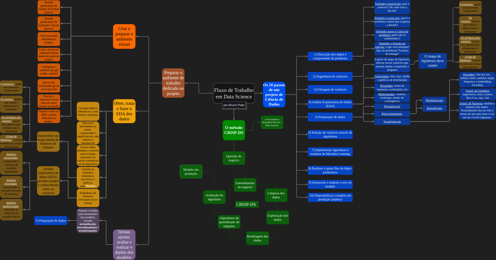

# Anotações e resumos das aulas da disciplina *Data Science em Produção* da *Comunidade Data Science*
*por Bruno Piato*

<!-- TOC -->

- [Anotações e resumos das aulas da disciplina *Data Science em Produção* da *Comunidade Data Science*](#anotações-e-resumos-das-aulas-da-disciplina-data-science-em-produção-da-comunidade-data-science)
  - [1. Programação de estudos](#1-programação-de-estudos)
  - [2. Fluxo de trabalho DS](#2-fluxo-de-trabalho-ds)
  - [3. Módulos resumidos](#3-módulos-resumidos)
    - [3.1. Módulo 01 - Entendendo o Problema de Negócio](#31-módulo-01---entendendo-o-problema-de-negócio)
    - [3.2. Módulo 02 - Análise Descritiva dos Dados](#32-módulo-02---análise-descritiva-dos-dados)
    - [3.3. Módulo 03 - Feature Engineering](#33-módulo-03---feature-engineering)
    - [3.4. Módulo 04 - Exploratory Data Analysis](#34-módulo-04---exploratory-data-analysis)
    - [3.5. Módulo 05 - Preparação dos Dados (pré-processamento)](#35-módulo-05---preparação-dos-dados-pré-processamento)
    - [3.6. Módulo 06 - Seleção de Atributos (Variáveis)](#36-módulo-06---seleção-de-atributos-variáveis)
    - [3.7. Módulo 07 - Treinamento de Algoritmos de Machine Learning](#37-módulo-07---treinamento-de-algoritmos-de-machine-learning)
    - [3.8. Módulo 08 - Hyperparameter Fine-Tuning](#38-módulo-08---hyperparameter-fine-tuning)
    - [3.9. Módulo 09 - Interpretação e Tradução dos Erros](#39-módulo-09---interpretação-e-tradução-dos-erros)
    - [3.10. Módulo 10 - Implantação (Deploy) do Modelo escolhido em Produção](#310-módulo-10---implantação-deploy-do-modelo-escolhido-em-produção)
    - [3.11. Módulo 11 - Bot no Telegram](#311-módulo-11---bot-no-telegram)

<!-- /TOC -->

## 1. Programação de estudos
| Assistir às aulas | Resumir as anotações de aula | Implementar os tutoriais das aulas|
| :---------------: | :--------------------------: | :-------------------------------: |
| [x] Módulo 01     |   [x] Módulo 01              |   [ ] Módulo 01                   |
| [x] Módulo 02     |   [x] Módulo 02              |   [ ] Módulo 02                   |
| [x] Módulo 03     |   [x] Módulo 03              |   [ ] Módulo 03                   |
| [x] Módulo 04     |   [x] Módulo 04              |   [ ] Módulo 04                   |
| [x] Módulo 05     |   [x] Módulo 05              |   [ ] Módulo 05                   |
| [x] Módulo 06     |   [x] Módulo 06              |   [ ] Módulo 06                   |
| [x] Módulo 07     |   [x] Módulo 07              |   [ ] Módulo 07                   |
| [x] Módulo 08     |   [x] Módulo 08              |   [ ] Módulo 08                   |
| [x] Módulo 09     |   [x] Módulo 09              |   [ ] Módulo 09                   |
| [ ] Módulo 10     |   [ ] Módulo 10              |   [ ] Módulo 10                   |
| [ ] Módulo 11     |   [ ] Módulo 11              |   [ ] Módulo 11                   |

## 2. Fluxo de trabalho DS

  

## 3. Módulos resumidos

### 3.1. Módulo 01 - Entendendo o Problema de Negócio
- O primeiro passo de qualquer projeto de Data Science é compreender o problema que queremos resolver. Para tanto podemos responder quatro perguntas básicas:
  - 1. *Entender a motivação:* qual é o contexto do problema? De onde ele veio?
  - 2. *Entender a causa raiz:* qual é o problema central de onde o problema que estamos tentando resolver se derivou? 
  - 3. *Entender quem é o dono do problema:* que vai se beneficiar da resposta? É a equipe de marketing? A de finanças? O próprio CEO? Quem são os stakeholders?
  - 4. *Entender o formato da solução*: como a resposta será entregue? Será uma tabela? Um dashboard? Um modelo em produção? Qual é a granularidade da resposta? Quais são os potenciais métodos de resolução?
- A partir de então podemos planejar nossa resolução aplicando o método de *Cross-Industry Standard Process - Data Mining* (CRISP-DM). 
  - O métodos CRISP é uma forma cíclica de trabalho em que uma série de passos são empregador ciclicamente a fim de ganhar agilidade no trabalho e na entrega, permitindo a retomada cíclica de todos os passos a fim de aprimorar sua implementação. Ele envolve **nove** passos:
    1. Entender a questão de negócios
    2. Entender o negócio
    3. Coletar os dados
    4. Limpar os dados
    5. Explorar os dados
    6. Modelar os dados
    7. Implementar algoritmos de aprendizado de máquina
    8. Avaliar os algoritmos implementados
    9. Colocar o algoritmo escolhido em produção

---

### 3.2. Módulo 02 - Análise Descritiva dos Dados

Uma vez que temos os dados em mãos, devemos explorá-los, analisá-los e investigá-los para entender com o quê estamos lidando, qual é o problema que queremos resolver, quais atributos temos disponíveis para resolvê-lo, etc. 

Portanto carregamos os dados no Python e realizamos uma primeira exploração sobre eles:
- Quantos linhas e colunas temos? Descrever os dados (*máximo*, *mínimo*, *média*, *quartis*, *dados faltantes*, etc).
```python
dataframe.shape
dataframe.info()
dataframe.describe()
datetime.dtypes()
dataframe.isnull().sum()
dataframe.isnull().mean()
dataframe.head()
dataframe.sample(5)
```
- Podemos, ainda, usar ferramentas específicas para realizar tais explorações, como os pacotes `YData Profiling`, `D-Tale`, `SweetViz`, `Missingno` e até mesmo ferramentas baseadas em IA como `Sketch`.
- Após fazer uma primeira exploração nos dados, podemos começar a arrumá-los para que possamos trabalhar mais confortavelmente, ajeitando os nomes das colunas, tipificando adequadamente cada variável, etc.
```python
dataframe.columns = [lista]
pd.to_datetime( dataframe['date'] )
dataframe['var1'].astype('str')
```
- Se quisermos, podemos realizar algumas plotagens genéricas de variáveis para verificar sua distribuição.
```python
seaborn.barplot(data=dataframe, x=var1, y=var2)
```
- Com relação aos dados faltantes, devemos avaliá-los com calma e decidir o que fazer com eles. À medida do possível devemos tentar conversar com especialistas e outras pessoas do negócio para entender o significado dos valores faltantes. Até mesmo para que, caso sejam valiosos, consertemos o problema onde ele está ocorrendo. Há três formas principais de lidar com dados faltantes:
  1. *Exclusão:* apesar de ser um método rápido e fácil, pode acabar perdendo dados importantes das linhas em que há informação
  2. *Interpretação a partir do negócio:* avaliar como colocar valores a partir do problema de neǵocio
  3. *Imputação de valores:* podemos imputar estes valores a partir de medidas de centralidade, como a média ou mediana, por exemplo, mas há métodos mais rebuscados em que interpolamos ou inferimos os valores a partir de algoritmos de imputação de valores faltantes.
---

### 3.3. Módulo 03 - Feature Engineering
- Agora que temos uma compreensão geral das variáveis que temos à nossa disposição, podemos elaborar um mapa mental do problema de negócios para que possamos criar hipóteses a serem testadas com base nos dados, através das quais ganharemos mais conhecimento do negócio e do problema que queremos resolver.
- Os mapas mentais de hipóteses devem conter quatro elementos básicos:
  1. *O fenômeno:* é aquilo que queremos compreender ou modelar. 
  2. *Os agentes:* são os fatores que atuam sobre o fenômeno, impactando-o.
  3. *Os atributos dos agentes:* são características dos agentes que podem moldar como eles impactam o fenômeno.
  4. *A lista de hipóteses:* são as hipóteses propriamente ditas, geradas a partir da avaliação do fenômeno, seus agentes e atributos. 
- Montado o mapa mental e a lista de hipóteses, podemos começar a testá-las. Para isso precisamos verificar se precisamos de variáveis que não estão presentes, mas que conseguimos derivar a partir daquelas que temos, como por exemplo o mês de venda a partir da data completa (*timestamp*) do pedido.
- Para isso podemos usar diversas ferramentas de filtragem e manipulação de dados, convertendo e criando variáveis.
```python
dataframe['var1'] = dataframe['var1'].apply( lambda x: 'basic' if x == 'a' else 'extra' if x == 'b' else 'extended' )

# competition since
df2['competition_since'] = df2.apply( lambda x: datetime.datetime( year=x['competition_open_since_year'], 
                            month=x['competition_open_since_month'],day=1 ), axis=1 )
df2['competition_time_month'] = ( ( df2['date'] - df2['competition_since'] )/30 ).apply( lambda x: x.days ).astype( int )
```
- Expressões `lambda x:`, o método `.apply()` e até mesmo a função `map()` são muito úteis para a engenharia de variáveis.
- Além disso, agora podemos escolher quais variáveis usaremos e quais já podemos descartar, caso haja variáveis que mais sujam os dados do que ajudam na construção dos modelos ou que são ambíguas ou não informativas. Após a EDA, poderemos excluir mais algumas.

---

### 3.4. Módulo 04 - Exploratory Data Analysis
- Com as variáveis limpas, renomeadas, derivadas e filtradas, podemos realizar uma bateria de análises exploratórias mais aprofundada, ganhando ainda mais compreensão do negócio e do problema que pretendemos solucionar.
- Há três profundidades com que podemos realizar nossa EDA:
  1. *Análises univariadas:* exploram apenas uma variável por vez. Podemos fazer análises descritivas, como média, min, max, std, etc ou podemos usar visualizações como histogramas e gráficos de pizza.
  2. *Análises bivariadas:* levam em consideração duas variáveis ao mesmo tempo, servindo para que avaliemos a relação entre elas. Podemos realizar alguns testes de hipótese estatísticos, como ANOVA, Chi², etc ou plotar gráficos como dispersão, gráfico de barras, etc.
  3. *Análises multivariadas:* consideram muitas variáveis ao mesmo tempo. Geralmente são visualizações como correlogramas, mapas de calor, matrizes de contingência, PCAs, etc.
- Para isso temos disponíveis uma grande gama de bibliotecas e ferramentas de visualização de dados, como `Seaborn`, `Matplotlib`, `plotnine`, `plotly`, etc.

---

### 3.5. Módulo 05 - Preparação dos Dados (pré-processamento)
- Assim que ganharmos um entendimento mais robusto sobre as variáveis e sua relação, podemos começar a preparar os dados para treinar os modelos que implementaremos. A maior parte dos modelos e das bibliotecas que os implementam requerem dados numéricos e escalonados, isto é, reparametrizados de modo que sua variação fique, mais ou menos, na mesma escala. Isto ocorre pois, caso os dados estejam em magnitudes diferentes (i.e. 100.000m e 2 anos), os modelos tendem a enfatizar os de maior magnitude.
- Há três tipos principais de preparação de dados:
  1. *Normalização*: usada amplamente para dados que já apresentem uma distribuição mais ou menos normal. Este tipo de pré-processamento modifica a distribuição da variável de modo que ela adquira uma distribuição normal com média 0 e desvio padrão 1. Ou seja, a variação dos dados se dá em termos de uma parcentagem ao redor da média.
  2. *Reescalonamento (Rescaling):* reescala todo o conjunto de dados da variável para que o intervalo fique compreendido de 0 a 1, sendo 0 o limite inferior (mínimo) e 1 o limite superior (máximo). É muito utilizado para distribuições não Gaussianas (normais). Há dois tipos principais de escalonamento:
     1. *MinMaxScaler:* usa especificamente os valores min e max para reescalonar os dados, ficando muito susceptível ao efeito de outliers.
     2. *RobustScaler:* usa os valores do 1o e 3o quartis para reescalonar os dados, reduzindo o efeito de outliers.
  3. *Transformação:* outras formas de transformações de dados, por exemplo métodos que transformam variáveis categóricas em variáveis numéricas. Há três tipos principais de transformações:
     1. *Transformações de grandeza:* mudam a grandeza da variável através de operações matemáticas e algoritmos visando aproximar a distribuição da variável à normalidade. Alguns exemplos mais utilizados são:
        1. Transformação logarítimica
        2. Transformação Box-Cox
        3. Transformação cube root (raiz cúbica)
        4. Transformação square root (raiz quadrada)
        5. Transformação de seno
        6. Transformação cosseno
     2. *Encoding:* transforma variáveis categóricas de natureza acíclica em variáveis numéricas através de codificações. Há diversos métodos de codificação, como por exemplo:
        1. One Hot Encoding 
        2. Ordinal Encodig
        3. Label Encoding
        4. Target Encoding
        5. Frequency Encoding
        6. Embedding Encoding
     3. *Transformações de natureza:* muito utilizada para dados cíclicos, como dias dos meses e meses do ano, uma vez que o dia 31 de um mês está tão próximo do dia 30 quanto está do dia 01. Da mesma maneira o mês de dezembro está tão próximo de novembro quanto está de janeiro. Geralmente utiliza o círculo trigonométrico e medidas de seno e cosseno para realizar as transformações de modo a manter a natureza cíclica dos dados, mas transformando-os em variáveis numéricas, permitindo cácluclos entre eles.
- Há diversos guias sobre transformações, rescalonamento e codificação. Abaixo há três que podem ser consultados:

[Guia de escalonamento e standardização](https://www.kaggle.com/code/discdiver/guide-to-scaling-and-standardizing/notebook)

[Encoders de cotegoria](https://contrib.scikit-learn.org/category_encoders/)

[Tudo sobre encoding de variáveis categóricas](https://towardsdatascience.com/all-about-categorical-variable-encoding-305f3361fd02)

- A biblioteca `scikit-learn`fornece diversos métodos de rescalonamento, codificação e transformação de variáveis.

```python
# Alguns exemplos de encodings

# Encoding com variáveis leigas
df5 = pd.get_dummies( df5, prefix=['state_holiday'], columns=['state_holiday'] )

# Encoding com LabelEncoder
le = LabelEncoder()
df5['store_type'] = le.fit_transform( df5['store_type'] )

# Encoding por associação
assortment_dict = {'basic': 1,  'extra': 2, 'extended': 3}
df5['assortment'] = df5['assortment'].map( assortment_dict )
```

---

### 3.6. Módulo 06 - Seleção de Atributos (Variáveis)
- Com as variáveis prontas, podemos selecionar aquelas que tem maior relevância para o modelo e fazer a última filtragem dos dados antes de, finalmente treinar os modelos que usaremos.
- Este é um passo importante pois temos a oportunidade de reduzir a dimensionalidade do conjunto de dados, selecionando apenas variáveis informativas e reduzindo a multicolinearidade, ou seja, as variáveis com alto grau de correlação entre si e que poderiam enviesar o modelo. 
- Com isso aumentamos a capacidade de aprendizado e predição do modelo, reduzindo seu viés.
- Há três métodos principais de seleção de variáveis:
  1. *Seleção univariada (filter methods):* utilizam análises da estatística inferencial para testar a relevância indivudual de cada variável contra a variável alvo (variável resporta). Podemos usar *ANOVA*, *Chi²*, *V de Cramer*, *Análise Linear Discriminantes (LDA)*, *Correlaçãp de Pearson*, etc. Apesar de serem fáceis e rápidas de implementar, acabam ignorando a possibilidade de interação entre variáveis.
  2. *Seleção por importância (embedded methods):* os métodos embutidos são subprodutos de alguns algoritmos de Machine Learning, isto é, não são o produto final do algoritmo, mas podem ser usados também para isso. Alguns algoritmos de ML (como *Random Forest*, *Lasso Regression* e *Ridge Regression*) tem métodos internos de seleção de variáveis. Podemos usar estes métodos para captar as variáveis mais relevantes segundo eles. Algoritmos de *Random Forest*, por exemplo, calculam a relevância de cada variável através da computação do índice de pureza de Gini. Ele divide o conjunto de dados em duas partes com base em uma variável e calcula o quão homogêneos os grupos são. Quanto mais homogêneos os grupos, mais importante é a variável. Ao final do treinamento, ele plota um gráfico (parecido com o biplot das PCAs) com os scores rankeados de cada variável. Existem outros métodos para realizar este cálculo, como o cálculo de entropia.
  3. *Seleção por subset (wrapper methods):* são algoritmos que escolhem, aleatoriamente, uma variável, treinam um modelo usar somente ela e calculam seu desempenho. Em seguida adicionam uma segunda variável aleatoriamente e retreinam o modelo e seu desempenho. Caso o desempenho tenha melhorado, a nova variável é mantida. Caso contrário, descartada. Estes passos são repetidos até esgotar as variáveis, gerando um subconjunto final de variáveis que serão usadas para treinar os modelos que avaliaremos no próximo passo. Um dos principais algoritmos de seleção de variáveis é o **Boruta**, que utiliza *Random Forests* para realizar a seleção.

```python
# A implementação do Boruta se parece com algo assim
X_train_n = X_train.drop( ['date', 'sales'], axis=1 ).values
y_train_n = y_train.values.ravel()
rf = RandomForestRegressor( n_jobs=-1 )
boruta = BorutaPy( rf, n_estimators='auto', verbose=2, random_state=42 ).fit( X_train_n, y_train_n )
# Este processamento pode demorar diversas horas, dependendo do camputador e do conjunto de dados
```
---

### 3.7. Módulo 07 - Treinamento de Algoritmos de Machine Learning 
- Selecionadas as variáveis que utilizaremos para treinar os modelos, podemos, enfim, treiná-los.
- Para isso nosso conjunto de dados tem que estar dividido em teste e treino
- O conjunto de treinamento será utilizado para ensinar aos modelos o padrão que queremos identificar e o rótulos (ou variável alvo) que queremos predizer.
- O conjunto de teste será utilizado *a posteriori* para avaliar o aprendizado dos modelos.
- Há quatro tipos de modelos de Machine Learning:
  1. *Aprendizado supervisionado:* é utilizado principalmente para classificação, regressão e séries temporais. Utilizado um conjunto de dados de treinamento que contém a variável alvo, de modo que possamos supervisionar o aprendizado do modelo, explicitando seus erros e acertos.
  2. *Aprendizado não-supervisionado:* é utilizado para problemas de clusterização (agrupamento) em que não sabemos o resultado da variável alvo ou saída, de modo que não conseguimos supervisionar o aprendizado do modelo.
  3. *Aprendizado semi-supervisionado:* é uma mescla dos dois anteriores.
  4. *Aprendizado por reforço:* é muito utilizado para resolver problemas em tempo real, uma vez que seu treinamento é feito constantemente durante seu uso. É muito utilizado para testes AB, por exemplo. Ele se baseia na tétrade cíclica: Agente --> Ação --> Ambiente --> Recompensa --> Agente
- Existem diversos modelos diferentes que serão estudados na disciplina de Fundamentos de Machine Learning.
- Aqui utilizaremos cinco modelos:
  - *Modelo de média:* é simplesmente a média por categoria e será usado como linha de base para comparação com os demais modelos.
  - *Modelo de Regressão Linear:* simples e de fácil implementação. Permite avaliar a linearidade das variáveis.
  - *Modelo de Regressão Linear Regularizada (Lasso):* regulariza as variáveis dando diferentes pesos.
  - *Modelo de Regressão Linear Regularizada (Ridge):* regulariza as variáveis dando diferentes pesos.
  - *Modelo de Regressão por Random Forest:* 
  - *Modelo de Regressão por XGBoost:* usa métodos de begging e boosting para selecionar as variáveis. É um modelo muito útil e robusto.
  
  <br></br>
  
  <br></br>
- Após treinarmos os modelos, precisamos, antes de medir as métricas de desempenho finais contra os dados de teste, realizar rodadas de cross-validation. Isto é necessário para garantir que não tenhamos, aleatoriamente, escolhido conjuntos de dados de teste e treino particularmente bons (ou ruins). 
- <span style="color:pink">**DÚVIDA:** CROSS-VALIDATION É FEITO PARA TODOS OS MODELOS OU APENAS PARA O QUE SELECIONARMOS COM BASE NAS MÉTRICAS DE DESEMPENHO CONTRA OS DADOS DE TESTE??</span>---><span style="color:lightblue"> R: Prioritariamente fazemos o cross-validation para todos os modelos implementados justamente a fim de identificar aquele que melhor desempenha sobre os dados.</span>
  - A ideia do cross-validation é dividir o conjunto de dados de treino em subconjuntos (pseudo-réplicas), retreinar os modelos e calcular seu desempenho diversas vezes, de modo que tenhamos uma distribuição de valores que possamos comparar com o que obtivermos com os dados de teste.
  - O cross-validation é realizado de forma diferente para problemas de classificação e regressão e problemas de séries temporais. Isto porque séries temporais são cronologicamente contextualizadas e, portanto, criar as pseudoréplicas de forma aleatória não faria sentido. Por isso, em problemas de séries temporais, as pseudoréplicas são feitas sequencialmente com cortes sucessivos do conjunto de dados. 
<br></br>

<br></br>
- O site do scikit-learn dá instruções de como realizar a separação de treino, teste e validação e realizar a cross-validation [aqui](https://scikit-learn.org/stable/modules/cross_validation.html).
  
```python
from sklearn.model_selection import cross_val_score
clf = svm.SVC(kernel='linear', C=1, random_state=42)
scores = cross_val_score(clf, X, y, cv=5)
```
- Com os valores de desempenho obtidos pelo método de cross-validation, podemos, agora, comparar com o desempenho do modelo frente aos dados de teste e escolher o modelo que melhor satisfaz nossas necessidades
- Uma vez escolhido o modelo, podemos partir para o ajuste fino dos hiperparâmetros.
---

### 3.8. Módulo 08 - Hyperparameter Fine-Tuning
- O ajuste fino de hiperparâmetros visa obter os melhores valores para os parâmetros do modelo escolhido, fazendo com que sua performance melhore ainda mais. A melhora de performance costuma girar em torno de 2% a 3% do desempenho, por isso precisamos avaliar o custo-benefício de sua aplicação.
- Isto porque há três métodos principais de obtenção dos valores dos parâmetros:
  1. *Random Search:* arbitrariamente escolhemos um rol de valores que cada parâmetro pode assumir e um número de combinações que queremos testar, e o algoritmo de busca encontra a melhor combinação de valores dentre aqueles que estipulamos *a priori* no número de sorteios. É bastante rápido, mas pouco eficaz, uma vez que pode acabar não encontrando os reais valores ideais dos parâmetros (e nem chegando próximo deles).
  2. *Grid Search:* arbitrariamente escolhemos um rol de valores que cada parâmetro pode assumir e o algoritmo avalia todas as combinações possíveis dos valores que estipulamos. Apesar de ser muito eficaz e, de fato, encontrar a melhor combinação de valores, pode demorar muito tempo no processo.
  3. *Bayes Search:* arbitrariamente escolhemos um rol de valores que cada parâmetro pode assumir e o algoritmo usa o teorema de Bayes para encontrar a melhor combinação de valores. O teorema de Bayes usa conhecimento anterior (de testes realizados anteriormente com os valores do parâmetro) para calcular a probabilidade posterior dos valores e achar a melhor estimvativa possível. É o mais eficiente dos três por otimizar tempo e, ainda assim, ser satisfatório em seus resultados. 
- Os algoritmos de fine-tuning podem demorar muitas horas para rodar pois a cada rodada de ajuste dos parâmetros ele retreina o modelo e re-estima métricas de desempenho para estipular o melhor conjunto de hiperparâmetros.

```python
# Definindo o conjunto de valores dos parâmetros e a quantidade de avaliações
param = {
   'n_estimators': [1500, 1700, 2500, 3000, 3500],
   'eta': [0.01, 0.03],
   'max_depth': [3, 5, 9],
   'subsample': [0.1, 0.5, 0.7],
   'colsample_bytree': [0.3, 0.7, 0.9],
   'min_child_weight': [3, 8, 15]
       }
MAX_EVAL = 5

# Criando um dataframe comparativo com os valores estipulados e comparados por Random Search (para ganhar tempo)
final_result = pd.DataFrame()
for i in range( MAX_EVAL ):
   # choose values for parameters randomly
   hp = { k: random.sample( v, 1 )[0] for k, v in param.items() }
   print( hp )
   
   # model
   model_xgb = xgb.XGBRegressor( objective='reg:squarederror',
                                 n_estimators=hp['n_estimators'], 
                                 eta=hp['eta'], 
                                 max_depth=hp['max_depth'], 
                                 subsample=hp['subsample'],
                                 colsample_bytee=hp['colsample_bytree'],
                                 min_child_weight=hp['min_child_weight'] )

   # performance
   result = cross_validation( x_training, 5, 'XGBoost Regressor', model_xgb, verbose=True )
   final_result = pd.concat( [final_result, result] )
final_result
```
---

### 3.9. Módulo 09 - Interpretação e Tradução dos Erros
- Os erros e métricas de avaliação de aprendizado e desempenho dos modelos servem para que possamos aferir sua capacidade de generalização e predição e para que possamos nos preparar para seu erro potencial.
- Existem diversas métricas diferentes que podem ser implementadas para os modelos, dependendo do modelo que estamos utilizando e do problema que estamos resolvendo.
- Problemas de classificação usam métricas como
  - Acurácia: quantas vezes o modelo acertou no geral
  - Retorno ou captura (recall): dos eventos de uma classe que tínhamos, quantos o modelo identificou corretamente
  - Precisão (precision): quantas vezes o modelo afirmou uma classe e ela era de fato aquela classe
  - F1-score: média harmônica entre retorno e precisão
- Problemas de regressão usam métricas como:
  - MAE (Mean Absolute Error): 
  - MAPE (Mean Absolute Percentage Error):
  - MSE (Means Square Error):
  - RMSE (Root Mean Square Error):
  - ME (Mean Error):
- Estas métricas serão melhor estudadas na disciplina de Fundamentos de Machine Learning

```python
#Aplicando MAE e MAPE
df9_aux1 = df9[['store', 'sales', 'predictions']].groupby( 'store' ).apply( lambda x: mean_absolute_error( x['sales'], x['predictions'] ) ).reset_index().rename( columns={0:'MAE'})
df9_aux2 = df9[['store', 'sales', 'predictions']].groupby( 'store' ).apply( lambda x: mean_absolute_percentage_error( x['sales'], x['predictions'] ) ).reset_index().rename( columns={0:'MAPE'})
```
---

### 3.10. Módulo 10 - Implantação (Deploy) do Modelo escolhido em Produção
- Já temos o modelo selecionado treinado, ajustado e avaliado de modo que possamos, então implementá-lo e colocá-lo em produção. Isto significa disponibilizá-lo para ser consumido e utilizado.
- Podemos disponibilizá-lo de diversas formas, como em aplicativos, dashboards, websites, etc. Geralmente isto é feito atrav;és de uma API que intermediará as requisições realizadas pelo usuário e o modelo hospedado em nuvem.
- Desta maneira devemos carregar o modelo, que ainda está em ambiente local, para ambiente de desenvolvimento em nuvem, onde será testado e, por fim, para o ambiente em produção, onde será empregado efetivamente.
- Para isso precisamos criar um Handler API, que fará a intermediação de requisições entre o usuário, o ambiente de produção e de volta para o usuário.
- 
---

### 3.11. Módulo 11 - Bot no Telegram

---
